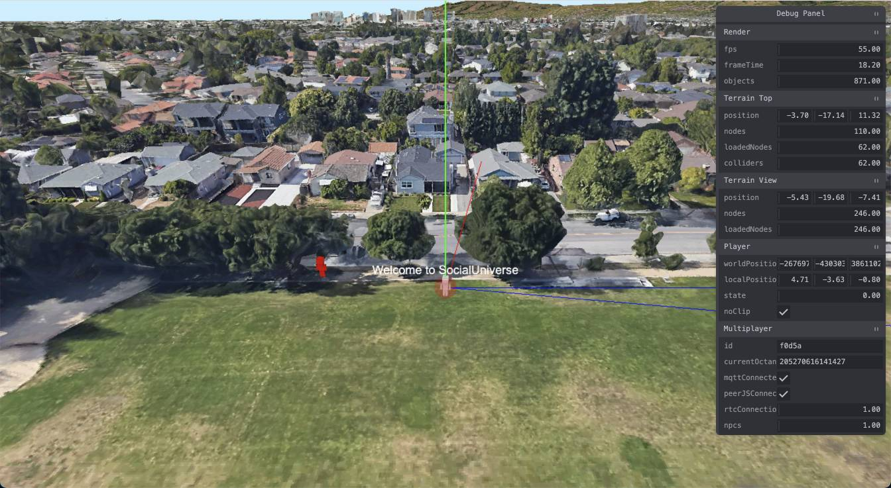

# SocialUniverse

[Click here to play](https://aifanatic.github.io/SocialUniverse/dist/index.html)

## Controls
- W,A,S,D - Move
- SPACE - Jump
- N - Toggle noclip
- Y - Chat

## Features
- 3D tiles (from google earth)
- Serverless Multiplayer (MQTT + WebRTC)
- Physics engine (PhysX)

## TODO
- [ ] Implement WorldShifter (partially implemented)
- [ ] Some textures are not compatible with Android
- [ ] Improve multiplayer (sometimes player doesn't join octant)
- [ ] Chat is kinda buggy
- [ ] Prettify (Fog, Sky, Atmosphere)

## Notes
This is a project implemented for fun so stable development should not be expect.

SocialUniverse streams 3d tile data from google, therefore it requires a stable and relatively fast internet connection.

## Disclaimer
This project has no affiliation with Google or any of its affiliates, there may by a chance that you will get a temporary ban from using google maps services due to the high volume of tiles being streamed.

The amount of streamed tiles should be similar to the ones used from using google earth and several caching mechanism are in place to prevent double streaming.
